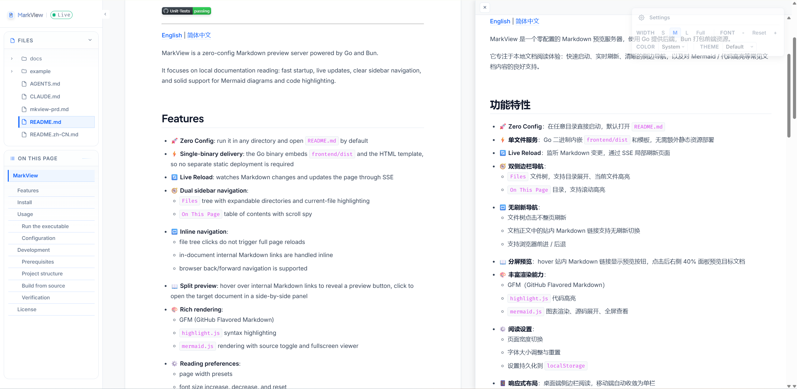

# MarkView


[](https://github.com/inhere/markview)
[](https://github.com/inhere/markview)

---

[English](./README.md) | [简体中文](./README.zh-CN.md)

MarkView is a zero-config Markdown preview server powered by Go and Bun.

It focuses on local documentation reading: fast startup, live updates, clear sidebar navigation, and solid support for Mermaid diagrams and code highlighting.



## Features

- **🚀 Zero Config**: run it in any directory and open `README.md` by default
- **⚡ Single-binary delivery**: the Go binary embeds `frontend/dist` and the HTML template, so no separate static deployment is required
- **🔄 Live Reload**: watches Markdown changes and updates the page through SSE
- **🧭 Dual sidebar navigation**:
  - `Files` tree with expandable directories and current-file highlighting
  - `On This Page` table of contents with scroll spy
- **🔁 Inline navigation**:
  - file tree clicks do not trigger full page reloads
  - in-document internal Markdown links are handled inline
  - browser back/forward navigation is supported
- **📖 Split preview**: hover over internal Markdown links to reveal a preview button, click to open the target document in a side-by-side panel
- **🎨 Rich rendering**:
  - GFM (GitHub Flavored Markdown)
  - `highlight.js` syntax highlighting
  - `mermaid.js` rendering with source toggle and fullscreen viewer
- **⚙️ Reading preferences**:
  - page width presets
  - font size increase, decrease, and reset
  - settings persisted in `localStorage`
- **📱 Responsive layout**: sidebar-first reading on desktop, single-column layout on mobile

## Install

```bash
go install github.com/inhere/markview@latest
```

## Usage

### Run the executable

Download and run `markview`:

```powershell
# Preview the current directory
markview [-p PORT]

# Preview a specific directory
markview "path/to/docs"

# Preview a specific directory and set the default entry file
markview "path/to/docs" "intro.md"
```

By default, the server starts at `http://localhost:6100`.

Example documents are available in [example/](example/).

### Configuration

You can override the port and default entry with environment variables:

```powershell
$env:MKVIEW_PORT = "8080"; .\markview
$env:MKVIEW_ENTRY = "guide.md"; .\markview
```

## Development

### Prerequisites

- **Go** 1.22+
- **Bun** 1.0+

### Project structure

```text
markview/
├── frontend/           # Frontend source, template, and build output
│   ├── src/
│   │   ├── app.ts              # Page lifecycle, navigation, orchestration
│   │   ├── sidebar.ts          # File tree and TOC logic
│   │   ├── mermaid.ts          # Mermaid enhancement and fullscreen behavior
│   │   ├── link-preview.ts     # Split preview for internal Markdown links
│   │   ├── preferences.ts      # Persisted reading preferences
│   │   └── live-status.ts      # SSE connection status handling
│   ├── template.html           # Main page template and CSS
│   ├── dist/                   # Bun build output embedded by Go
│   └── package.json
├── main.go                     # Go server entrypoint
├── handlers.go                 # Cache header and handler helpers
├── example/                    # Example Markdown documents
└── README.md
```

### Build from source

1. Install frontend dependencies and build:

```bash
cd frontend
bun install
bun run build
```

This generates `frontend/dist/` and also copies:
- `highlight.css`
- `logo.svg`
- `favicon.svg`

2. Build the backend:

```bash
cd ..
go build --ldflags "-w -s" -o markview

# Or install to GOPATH/bin
go install -ldflags "-s -w" .
```

You can also use the provided `Makefile`:

```bash
make frontend
make build
make run
```

### Verification

Useful verification commands:

```bash
go test ./...
cd frontend && bun test ./src/*.test.ts
cd frontend && bun run build
```

> `go:embed` packages both `frontend/template.html` and `frontend/dist/` into the final binary.

## License

MIT
