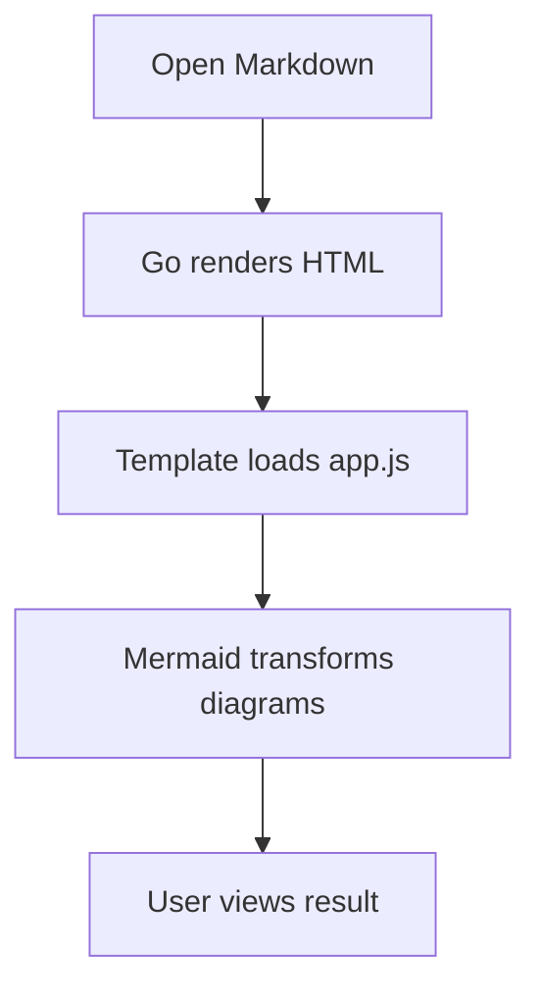
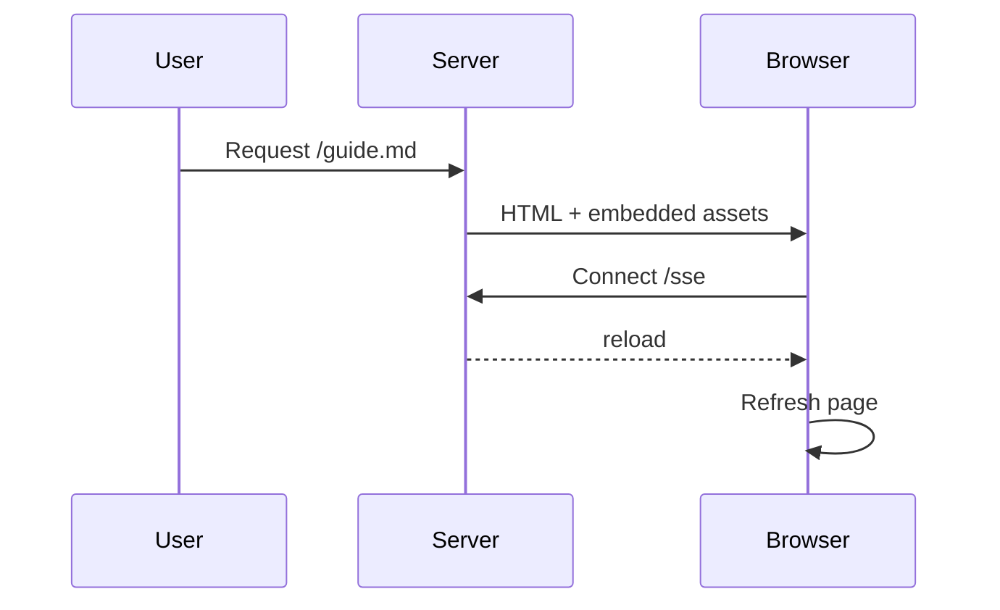

# Mermaid 示例

下面的代码块用于验证 Mermaid 是否会被前端脚本替换成可交互图表。

## Flowchart

```mermaid
flowchart TD
    A[Open Markdown] --> B[Go renders HTML]
    B --> C[Template loads app.js]
    C --> D[Mermaid transforms diagrams]
    D --> E[User views result]
```

## Sequence Diagram

```mermaid
sequenceDiagram
    participant U as User
    participant S as Server
    participant B as Browser

    U->>S: Request /guide.md
    S->>B: HTML + embedded assets
    B->>S: Connect /sse
    S-->>B: reload
    B->>B: Refresh page
```

## Tips

- 点击 Mermaid 右上角按钮可以放大查看。
- 修改本目录下任意 `.md` 文件后，页面应自动刷新。
